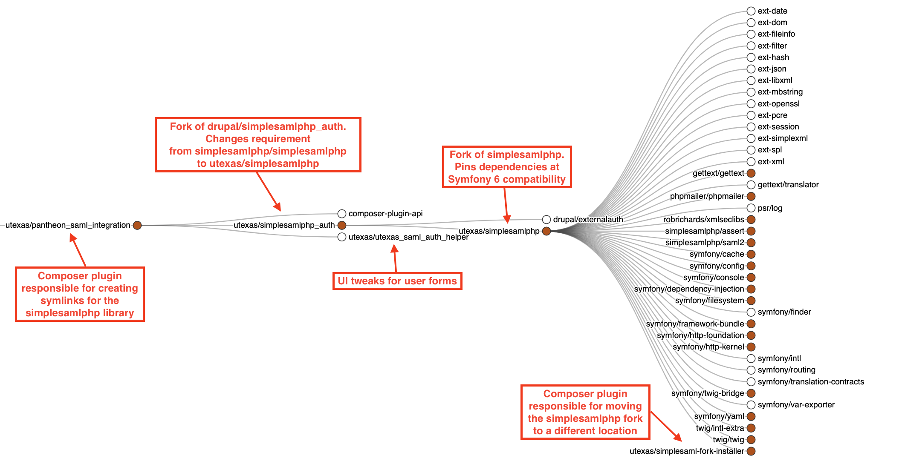

# Pantheon SAML Integration
This is a Composer plugin that integrates the University of Texas Enterprise Authentication on Pantheon.

Full user documentation can be found at https://drupalkit.its.utexas.edu/docs/getting_started/pantheon_setup.html#integrating-enterprise-authentication

## Usage with WordPress
At a minimum, a WordPress site's `composer.json` file needs to include the following directives:

```json
    "extra": {
        "installer-paths": {
            "wp-content/plugins/{$name}/": ["type:wordpress-plugin"],
            "wp-content/themes/{$name}/": ["type:wordpress-theme"]
        },
        "enable-patching": true,
        "composer-exit-on-patch-failure": true
    },
```

If the site's webroot is not the project root (e.g., `web` and/or the WordPress installation directory is different, they must be specified as shown below):

```json
    "extra": {
        ...
        "web-root": "ENTER-LOCATION",
        "wordpress-install-dir": "ENTER-LOCATION",
    },
```


## Architectural overview
Getting the University's SAML-based sign-in method (Enterprise Authentication) working with Drupal, on Pantheon, involves a coordination of different components. The following provides a high-level explanation of how the pieces fit together:

1. **[Enterprise Authentication](https://ut.service-now.com/sp?id=ut_bs_service_detail&sys_id=30cb4f61db6c0450838fdee5ce961979)**: the login system, developed and maintained by the University's Information and Access Management (IAM) team that allows applications to use EID-based authentication. It supports Security Assertion Markup Language version 2.0 (SAML 2). In Single Sign On (SSO) terminology, this acts as the Identity Provider (IdP).
2. **[simplesamlphp](https://simplesamlphp.org/) library**: a third-party library which provides the business logic to handle SAML requests in PHP. It has a large collection of sub-libraries. We use only the base library. In SSO terminology, it acts as the Service Provider (SP).
3. **pantheon_saml_data**. This is a collection of certificate and metadata attributes that authorize the `simplesamlphp` library to talk to Enterprise Authentication. These were provisioned in coordination with the IAM team.
4. **[simplesamlphp_auth](https://drupal.org/project/simplesamlphp_auth):** A Drupal module that integrates the request/response API from `simplesamlphp` into Drupal's authentication system. Specifically, it provides a way for Drupal to redirect users to Enterprise Authentication and then evaluate the response sent back after a login and take action with Drupal's user login/registration system based on that response. We also use this module on some sites to do EID-affiliation-based authorization, such as allowing EID holders with the affiliation `current-staff` to receive the Drupal role `staff`.
5. **[pantheon_saml_integration](https://github.austin.utexas.edu/eis1-wcs/pantheon_saml_integration):** a Composer plugin developed by the WCMS team to connect the above components in the Pantheon filesystem. This plugin, for example, creates a required symlink at `/simplesaml` for the simplesamlphp library, and symlinks for the certificates and metadata from Pantheon's private file system. As a Composer plugin distributed on Packagist that has a dependency on `simplesamlphp_auth`, it is the only package sites need to require in their `composer.json` to have all the elements needed in the codebase.

## 2023 simplesamlphp fork
Drupal 10 has a dependency on Symfony 6. At the beginning of 2023, when our team was working on upgrading sites to Drupal 10, there was no stable release of `simplesamlphp` that was compatible with Symfony 6.

References:
- https://www.drupal.org/project/simplesamlphp_auth/issues/3349278
- https://github.com/simplesamlphp/simplesamlphp/issues/1689
- https://github.com/simplesamlphp/simplesamlphp/issues/1798

After substantial research, our team decided that the best option would be to temporarily provide a fork of the `simplesamlphp` library that was compatible with Symfony 6.

Doing so required additional forking of the Drupal module `simplesamlphp_auth` to change its requirement from `simplesamlphp/simplesamlphp` to `utexas/simplesamlphp` (our fork), and an additional Composer plugin, [utexas/simplesaml-fork-installer](https://github.austin.utexas.edu/eis1-wcs/simplesaml-fork-installer), to relocate our fork into the expected location of the original library.

The visual below illustrates the relationship of these packages for the 2023 fork methodology:


